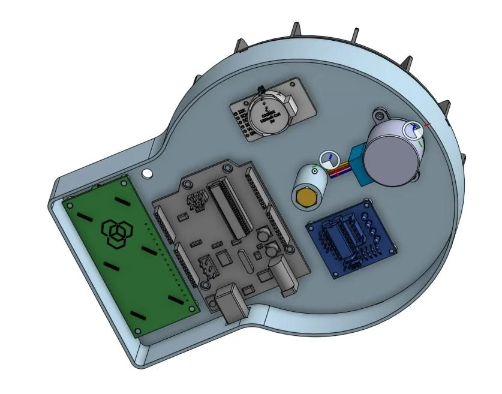
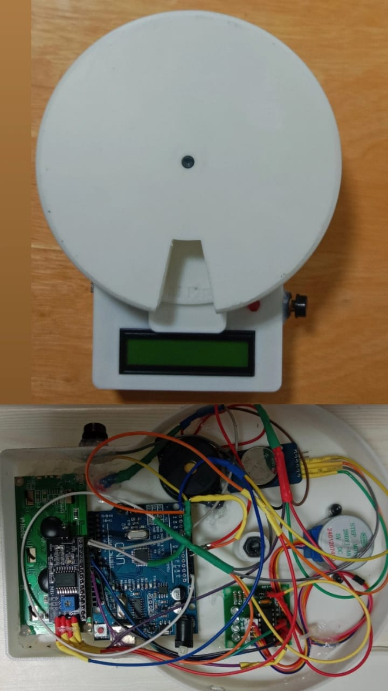

AUTOMATIC MEDICINE DISPENSER
     
      "We have created this medicine dispenser for elderly people and those who regularly take medication. People often forget to take their medicines on time, so this dispenser ensures they can take their medicine at the correct time without any delays.

HOW IT WORKS:
  *Medicine Storage:
The dispenser has compartments to store different medicines, each clearly labeled for easy identification.

  *Timing Function:
The dispenser is programmed to release the correct medicine at specific times. The user sets up the time intervals when the medicines should be taken.

  *Dispensing Medicine:
At the scheduled time, the dispenser automatically releases the correct amount of medicine from the compartment.

  *Indication for Taking Medicine:
When the medicine is ready to be taken, the dispenser shows a display or light indicator. A buzzer or alarm also sounds to remind the user that it's time to take the medicine.

  *Confirmation:
Once the user takes the medicine, they press a button to confirm. This turns off the alarm and resets the dispenser for the next scheduled dose.
              
SUPPLIES:

       *Arduino Uno Board and USB cable 
       *LCD display 1602 12C 16x2 
       *Clock DS3231 
       *Motor 28BYJ Stepper motor and ULN2003 driver 
       *5mm LED
       *Buzzer
       *330ohm  Resistor
       *Push button switch and Cap
       *Wire for connections
       *M6 50mm bolt
       *Glue gun
       *Superglue
       *Soldering iron and solde
       *3D printer and PLA
        
DESIGING PROCESS:
    
    The criteria for the dispenser was:

     *Needed to be compact so that it could sit without taking up too much space 
     *Be able to hold and dispense medication for a week
     *The time for dispensing could be adjusted
     *Provide a visual display of time and when tablets were ready
     *After dispensing, it should be indicated by an alarm, and the LED should blink.

The simplest way to store the tablets was a circle with separate containers for each set of tablets around the edge. Each container needed to be large enough to contain sufficient tablets. I decided to have 14 containers (7days AM and PM) plus one spare so that this could be positioned in the opening when the dispenser was refilled so a total of 15. This then determined how big it needed to be.

The next thing was how to rotate the dispenser, I had a 28BYJ stepper motor which are cheap and readily available. I decided to use an internal gear ring fixed to the underside of the dispenser which would be driven by a small gear on the stepper motor. I used a gear ration of 7.5 to 1 which is divisible into 15 so I can easily set the the stepper motor to turn half a revolution and move each container exactly.

The base of the unit had to hold all the electronics and motor, and ideally have locators so the the various parts could be easily mounted and glued in place.

             3D MODEL:

We designed this using OnShape, I am using the free licence for hobbyists so the model is freely available for others to copy and use here.

Based on the concept as set out above I designed each part so that as many as possible could be printed without any support.

There are 7 main parts:

The base containing all the electronics.
          Holes for the stepper motor, Arduino Power supply, LCD display and push button. The LED bulb was an afterthought and a hole had to be drilled in the base.
          Three small slots around the edge help to align the lid.
          We managed to find 3D models of the components which I could then use to make sure they all fitted into the base and finalise their location and mounting pins, fixing holes and access holes.
Centre spindle over which the container sits.
Internal gear which is glued to the base of the container. Location pins are on top of the gear which align with corresponding holes in the container.
Small gear which fits to the stepper motor
The container.
          This has vertical walls to divide each compartment.
          Each compartment is labelled with the day Initial and Am or Pm
The Lid to cover the container and stop pills falling out
          This has an opening corresponding to one of the container slots
          Three lugs are included on the bottom edge to align the lid and base
Dish to receive the tablets
 

             PRINTING AND BUILDING:

All the components were exported as STL models at the highest resolution. We used Ultimaker Cura to slice the models and printed them with a layer height of 0.2mm.

 printer is an Ender 3

Specifics for each component are:

Base: Needs printing with support for holes in the side and alignment slots. Print with top on the printer bed.
Gears: Print with 50% infill, no support
Spindle: Print with 20% infill, no support
Container: Print with 100% infill, no support
Lid: Print with top face on the print bed, 100% infill, no support

Building

Once all the parts have been printed they will need to be cleaned up, remove any supports from the holes. There is usually a little edge where the piece adheres to the print bed this can be removed with a file or sand paper. The gears will need to be smoothed and cleaned up so that they run smoothly.

Hopefully the pins in the base correspond with the mounting holes on your components however depending on manufacturer the holes don't always appear in the same place. Test all components before trying to glue in, if the don't fit either remove the pips on the post and glue on the post or if they are very different remove the post, i have included an STL model to print new posts which can be superglued to the bas in the right place.

It is easier to solder some of the wires to the components before fixing them into the base.

The Stepper motor is fixed to the base with 2 screws.

All the other components are glued in place with a glue gun.

I also applied some glue to hold some of the wires in place.

The inner gear is superglued to the container, the pins on the gear align with the holes on the container. The centre spindle is pushed through the container from the underside and superglued in place.

The small gear can now be pushed onto the motor spindle.

Insert the M6 bolt through the bottom of the base this acts as the main spindle, it can be superglued in place where the hex head is inserted in the base.

The container can now be placed onto the main spindle and gears aligned the lid can be clipped over the top.

Now position the dish in front of the opening in the lid and superglue in place, being careful not to glue it to the lid or container.

        PROGRAMMING:
        The Automatic Medicine Dispenser is designed to automatically give the correct dose of medicine at the right time. The programming of this device ensures it can handle all the tasks needed to dispense medicine safely and on time.

How the Code Works:

    *Setup Function:

The setup() function is used to initialize the device. Here, you set the correct pins for the LED, buzzer, and dispensing motor. You also initialize the timer for doses.
void setup() {
  pinMode(LED_PIN, OUTPUT);    // Set the LED as an output
  pinMode(BUZZER_PIN, OUTPUT); // Set the buzzer as an output
  pinMode(DISPENSE_PIN, OUTPUT); // Set the dispensing motor pin as an output
  pinMode(BUTTON_PIN, INPUT);   // Set the button as an input
}
    *Loop Function:

The loop() function runs continuously. It checks if it's time to dispense medicine, activates the buzzer and LED, and waits for the user to confirm that the medicine has been taken.

 void loop() {
  if (timeToDispense()) {       // Check if it's time to dispense the medicine
    digitalWrite(BUZZER_PIN, HIGH);  // Turn on the buzzer
    digitalWrite(LED_PIN, HIGH);     // Turn on the LED

    dispenseMedicine();            // Activate the motor to dispense the medicine
  }

  if (digitalRead(BUTTON_PIN) == HIGH) {   // Check if the user pressed the button
    digitalWrite(BUZZER_PIN, LOW);  // Turn off the buzzer
    digitalWrite(LED_PIN, LOW);     // Turn off the LED
    resetTimer();                  // Reset the timer for the next dose
  }
}

    *Timer Function:

    A timer checks the time and triggers the medicine dispensing at the correct intervals.

    bool timeToDispense() {
  // Logic to check if the current time matches the scheduled dose time
  return (currentTime == doseTime);
}

       *Dispensing Medicine:

The dispenseMedicine() function controls the motor that releases the medicine from the compartment.

void dispenseMedicine() {
  digitalWrite(DISPENSE_PIN, HIGH);  // Activate motor to release medicine
  delay(5000);                      // Let the motor run for 5 seconds
  digitalWrite(DISPENSE_PIN, LOW);   // Stop the motor
}

       *Reset Timer:

After the user confirms that they’ve taken the medicine, the system resets the timer for the next scheduled dose.

void resetTimer() {
  // Reset the time counter or timer for the next dose
  currentTime = 0;  // Resetting to the initial time for the next cycle
}

 CONCLUSION:

The Automatic Medicine Dispenser offers a valuable solution for individuals who need help adhering to their medication schedules. By automating the dispensing process, providing reminders, and confirming medication intake, it ensures that users take the right medicine at the right time.
 The dispenser does come with some drawbacks. They may include:
    *Dependence on Technology: 
Users may become reliant on the device, potentially leading to issues if the system malfunctions or is not set up properly.
    *Limited Flexibility: 
The device may not be suitable for complex or irregular medication schedules.
    *Power Dependency: 
The dispenser requires a consistent power source, and any power failure may affect its functionality.
    *Maintenance and Cleaning:
 Regular upkeep may be necessary to ensure the dispenser functions correctly.

